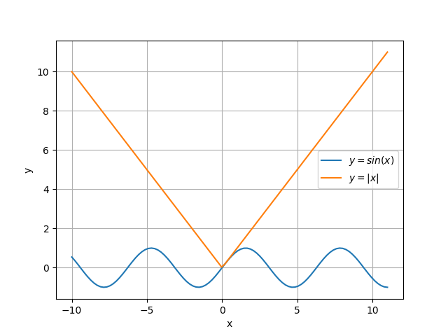
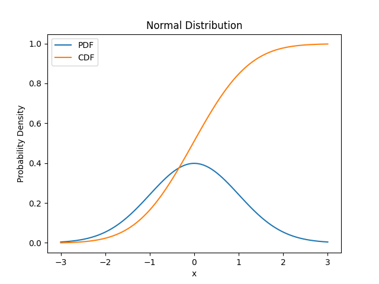

<!-- 
_class: invert lead
_paginate: skip
 -->

# Math review

COMP 4630 | Winter 2025
Charlotte Curtis

---

## But first, some stuff about assessments
- [Assignment 1](../../assignments/assignment1.md)
- [Journal club guidelines](../../journal_club.md)
- [Example](https://arxiv.org/abs/1503.03585) of a math-heavy paper
- Additional references for papers:
    - [Google Scholar](https://scholar.google.com/)
    - [ArXiv](https://arxiv.org/)
    - [Retraction Watch](https://retractionwatch.com/)

---

## Math review
- MATH 1200: Differential calculus
- MATH 1203: Linear algebra
- MATH 2234: Statistics

Further reading: 
- Calculus: [notebook](https://github.com/ageron/handson-ml3/blob/main/math_differential_calculus.ipynb)
- Linear algebra: [notebook](https://github.com/ageron/handson-ml3/blob/main/math_linear_algebra.ipynb), [deep learning book](https://www.deeplearningbook.org/contents/linear_algebra.html)

---

## Calculus: Notation
The **derivative** of a function $y = f(x)$ is represented as:

$$f'(x) = \frac{dy}{dx} = \lim_{h \to 0} \frac{f(x+h) - f(x)}{h}$$

The **second derivative** is denoted:

$$f''(x) = \frac{d^2y}{dx^2} = \frac{d}{dx} \left( \frac{dy}{dx} \right)$$

and so on.

---

## Differentiability

For a function to be **differentiable** at a point $x_A$, it must be:
* **Defined** at $x_A$
* **Continuous** at $x_A$
* **Smooth** at $x_A$
* **Non-vertical** at $x_A$

---

## Select rules of differentiation 

|                 | Function $f$                 | Lagrange               | Leibniz                                         |
| --------------- | ---------------------------- | ----------------------- | ----------------------------------------------- |
| **Constant**    | $f(x) = c$                   | $f'(x) = 0$             | $\dfrac{df}{dx} = 0$                             |
| **Power**       | $f(x) = x^r$ with $r \neq 0$ | $f'(x) = rx^{r-1}$      | $\dfrac{df}{dx} = rx^{r-1}$                      |
| **Sum**         | $f(x) = g(x) + h(x)$         | $f'(x) = g'(x) + h'(x)$ | $\dfrac{df}{dx} = \dfrac{dg}{dx} + \dfrac{dh}{dx}$ |
| **Exponential** | $f(x) = e^x$                 | $f'(x) = e^x$           | $\dfrac{df}{dx} = e^x$                           |
| **Chain Rule**  | $f(x) = g(h(x))$             | $f'(x) = g'(h(x))h'(x)$ | $\dfrac{df}{dx} = \dfrac{dg}{dh}\dfrac{dh}{dx}$    |

<footer>This is the kind of thing I would not expect you to memorize on an exam</footer>

---

## Example

1) Find $f'(x)$ for $f(x) = \sigma(x) = \dfrac{1}{1 + e^{-x}}$

2) Now, let, $y = \sigma(x_1)$, where $x_1 = wx$. What is $\dfrac{dy}{dx}$?

---

## Partial derivatives
For a scalar valued function $y = f(x_1, x_2)$, there are two partial derivatives:

$$\dfrac{\partial y}{\partial x_1}, \dfrac{\partial y}{\partial x_2}$$

These are computed by holding the "other" variable(s) **constant**. For example, if $y = 2x_1 + x_2 + x_1x_2$, then:

$$\dfrac{\partial y}{\partial x_1} = 2 + x_2, \dfrac{\partial y}{\partial x_2} = 1 + x_1$$

---

# Linear algebra

**Vectors** are multidimensional quantities (unlike **scalars**):

$$\vec{v} = \mathbf{v} = \begin{bmatrix} v_1 \\ v_2 \\ \vdots \\ v_n \end{bmatrix}$$

A common **vector space** is $\mathbb{R}^2$, or the 2D Euclidean plane. Example: 

$$\mathbf{v}_1 = \begin{bmatrix} 3 \\ 4 \end{bmatrix}$$

---

## Vector operations
* **Addition**: $\mathbf{v}_1 + \mathbf{v}_2 = \begin{bmatrix} v_{11} + v_{21} \\ v_{12} + v_{22} \end{bmatrix}$
* **Scalar multiplication**: $c\mathbf{v} = \begin{bmatrix} cv_1 \\ cv_2 \end{bmatrix}$ 
* **Dot product**: $\mathbf{v}_1 \cdot \mathbf{v}_2 = v_{11}v_{21} + v_{12}v_{22}$ (yields a scalar)
  - Can be thought of as the **projection** of one vector onto another, or how much two vectors are aligned in the same direction

---

## Vector norms
* The **norm** of a vector is a measure of its length
* Most common is the **Euclidean norm** (or $L^2$ norm):
    $$\|\mathbf{v}\|_2 = \|\mathbf{v}\| = \sqrt{\left(\sum_{i=1}^n v_i^2\right)}$$
* You might also see the $L^1$ norm, particularly as a regularization term:
    $$\|\mathbf{v}\|_1 = \sum_{i=1}^n |v_i|$$

---

## Useful vectors
* **Unit vector**: A vector with a norm of 1, e.g. $\mathbf{x} = \begin{bmatrix} 1 \\ 0 \end{bmatrix}$, $\mathbf{y} = \begin{bmatrix} 0 \\ 1 \end{bmatrix}$
* **Normalized vector**: A vector divided by its norm, e.g. $\mathbf{v} = \mathbf{\hat{v}} = \dfrac{\mathbf{v}}{\|\mathbf{v}\|}$
* Dot product can also be written as $\mathbf{v}_1 \cdot \mathbf{v}_2 = \|\mathbf{v}_1\| \|\mathbf{v}_2\| \cos(\theta)$

> Yes, a normalized vector is also a unit vector, main difference is in context and notation

---

## Matrices
A **matrix** is a 2D array of numbers:

$$A = \begin{bmatrix} a_{11} & a_{12} & a_{13} \\ a_{21} & a_{22} & a_{23}\end{bmatrix}$$

Notation: Element $a_{ij}$ is in row $i$, column $j$, also written as $A_{ij}$.

> Rows then columns! $M \times N$ matrix has $M$ rows and $N$ columns

---

## Matrix operations

* **Addition**: element-wise *if* dimensions match. $A + B = B + A$
* **Scalar multiplication**: just like vectors
* **Matrix multiplication**: $C = AB$ where the elements of $C$ are:
    $$c_{ij} = \sum_{k=1}^n a_{ik}b_{kj}$$
  - Multiply and sum rows of $A$ with columns of $B$
  - Usually, $AB \neq BA$

---

## Matrix multiplication examples
Matrix times a matrix:
$$A = \begin{bmatrix} 2 & 0 \\ 1 & 3 \\ -4 & 5 \end{bmatrix}, B = \begin{bmatrix} -1 & 0 & 1 \\ 1 & 3 & 7\end{bmatrix}$$

Matrix times a vector:
$$A = \begin{bmatrix} 0 & -1 \\ 1 & 0 \end{bmatrix}, \mathbf{v} = \begin{bmatrix} 1 \\ 0 \end{bmatrix}$$

---

## Matrix transpose
* **Transpose**: $A^T$ swaps rows and columns
    $$A = \begin{bmatrix} 1 & 2 \\ 3 & 4 \end{bmatrix}, A^T = \begin{bmatrix} 1 & 3 \\ 2 & 4 \end{bmatrix}$$

* **Inverse**: just as $\dfrac{1}{x} \cdot x = 1$, $A^{-1}A = I$, where $I$ is the identity matrix
    $$A = \begin{bmatrix} 1 & 2 \\ 3 & 4 \end{bmatrix}, A^{-1} = \begin{bmatrix} -2 & 1 \\ 1.5 & -0.5 \end{bmatrix}, A^{-1}A = \begin{bmatrix} 1 & 0 \\ 0 & 1 \end{bmatrix}$$

> Not every matrix is invertible!

---

# A brief introduction to vector calculus
Putting together partial derivatives with vectors and matrices we get:

Scalar-valued $f(\mathbf{x})$:

$$\nabla f = \begin{bmatrix} \frac{\partial f}{\partial x_1} \\ \frac{\partial f}{\partial x_2} \\ \vdots \\ \frac{\partial f}{\partial x_n} \end{bmatrix}$$

Vector-valued $\mathbf{f}(\mathbf{x})$:

$$\mathbf{J_f} = \begin{bmatrix} \nabla^T f_1 \\ \nabla^T f_2 \\ \vdots \\ \nabla^T f_m \end{bmatrix} = \begin{bmatrix} \frac{\partial f_1}{\partial x_1} & \cdots & \frac{\partial f_1}{\partial x_n} \\ \vdots & \ddots & \vdots \\ \frac{\partial f_m}{\partial x_1} & \cdots & \frac{\partial f_m}{\partial x_n} \end{bmatrix}$$

> Most of the time we'll just be working with the gradient

---

# Statistics: Notation

* A **random variable** $\mathrm{x} \sim P$ is a variable that can take on random variables according to some probability distribution $P$
* $\mathrm{x}$ may take on **discrete** (e.g. dice rolls) or **continuous** (e.g. age) values
* $X$ or $\mathrm{x}$ for the random variable and $x$ or $x_i$ for a specific value
* $P(\mathrm{x})$ for a a discrete distribution and $p(\mathrm{x})$ for continuous
* $\mathrm{x}_P \equiv \mathrm{x} \sim P$ and $\mathrm{x}_p \equiv \mathrm{x} \sim p$

> Some textbooks/papers/websites use different notation!

---

## Discrete random variables
* A discrete **probability mass function** describes the probability of $\mathrm{x}$ taking on a specific value
* Example: for a balanced 6-sided die, $P(\mathrm{x} = 1) = \dfrac{1}{6}$
* You can add together probabilities, e.g. $P(\mathrm{x} \leq 3) = \sum\limits_{i=1}^3 P(\mathrm{x} = i)$
* $\sum\limits_{x} P(\mathrm{x}) = 1$ and $P(x_i) \ge 0$ for any valid distribution

---

## Continuous random variables

* A continuous **probability density function** gives the probability of being in some tiny interval $\delta x$ given by $p(x) \delta x$
* Example: the **uniform distribution**, $p(\mathrm{x}) = \dfrac{1}{b-a}$ for $a \le x \le b$
* $p(\mathrm{x} = x_i) = 0$ for any specific value $x_i$
* Need to integrate to get a concrete value, e.g. $P(\mathrm{x} \le a) = \displaystyle\int_a^b p(x) dx$
* $\displaystyle\int_{-\infty}^\infty p(x) dx = 1$ and $\displaystyle\int_a^b p(x) dx \ge 0$ for any valid distribution

---

## Expectation and variance
* The **expectation** or **expected value** is its average value $\mathbb{E}[\mathrm{x}]$
* $\mathbb{E}[\mathrm{x}_P] = \sum\limits_{x} x P(\mathrm{x})$ and $\mathbb{E}[\mathrm{x}_p] = \displaystyle\int_{-\infty}^\infty x p(x) dx$
* More generally, for any function $f(\mathrm{x})$:
$$\mathbb{E}[f(\mathrm{x})] = \sum_x f(x) P(\mathrm{x}) \hspace{1em}\mathrm{and}\hspace{1em} \int_{-\infty}^\infty f(x) p(x) dx$$
* The **variance** describes how much the values vary from their mean:
$$\mathrm{Var}[\mathrm{x}] = \mathbb{E}[(\mathrm{x} - \mathbb{E}[\mathrm{x}])^2]$$

---

## Multiple random variables
* **Joint probability** $P(\mathrm{x}, \mathrm{y})$ is the probability of $\mathrm{x}$ and $\mathrm{y}$ occurring together
* **Conditional probability** $P(\mathrm{x} = x \mid \mathrm{y} = y)$ is the probability that $\mathrm{x}$ takes on value $x$ given that $\mathrm{y} = y$ has already happened
* In general, $P(\mathrm{x} = x \mid \mathrm{y} = y) = \dfrac{P(\mathrm{x} = x, \mathrm{y} = y)}{P(\mathrm{y} = y)}$
* For **independent** variables, $P(\mathrm{x} = x \mid \mathrm{y} = y) = P(\mathrm{x} = x)$

<footer>Note: I'm using uppercase P here, but it all applies to continuous distributions as well</footer>

---

## Covariance
* The **covariance** between $f(\mathrm{x})$ and $g(\mathrm{y})$ gives a sense of how linearly related they are and how much they vary together:
$$\mathrm{Cov}(f(\mathrm{x}), g(\mathrm{y})) = \mathbb{E}[(f(\mathrm{x}) - \mathbb{E}[f(\mathrm{x})])(g(\mathrm{y}) - \mathbb{E}[g(\mathrm{y})])]$$
* Related to correlation as $\mathrm{Corr}(f(\mathrm{x}), g(\mathrm{y})) = \dfrac{\mathrm{Cov}(f(\mathrm{x}), g(\mathrm{y}))}{\sqrt{\mathrm{Var}(f(\mathrm{x}))\mathrm{Var}(g(\mathrm{y}))}}$
* The **covariance matrix** of a random vector $\mathbf{x}$ is a square matrix where the $(i, j)$ element is the covariance between $x_i$ and $x_j$
* The diagonal of the covariance matrix gives $\mathrm{Var}(x_i)$

---

## The Normal distribution

$$N(x; u, \sigma^2) = \sqrt{\frac{1}{2\pi\sigma^2}}\exp^{\left(-\frac{1}{2\sigma^2}(x - \mu)^2\right)}$$

Good "default choice" for two reasons:
* The **central limit theorem** shows that the sum of many ($>30$ ish) independent random variables is normally distributed
* Has the most **uncertainty** of any distribution with the same variance

> We can't easily integrate $N(x)$, so numerical approximations are used

---

