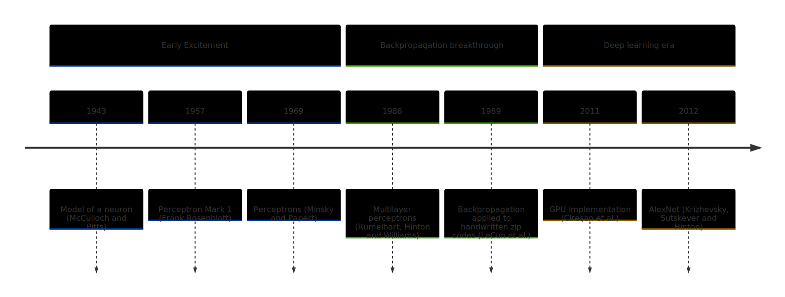
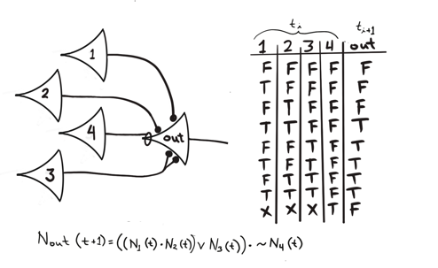
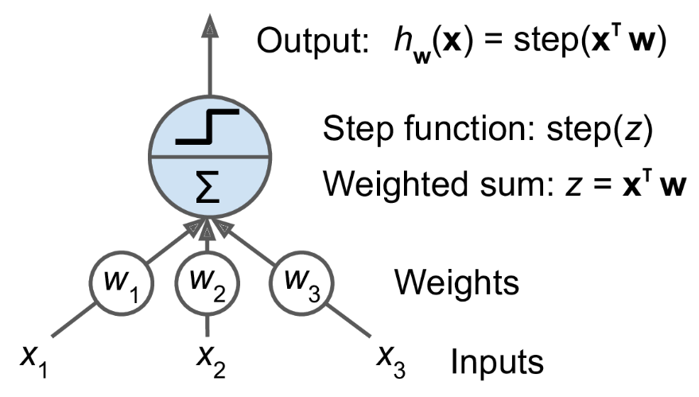
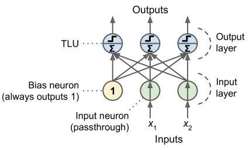
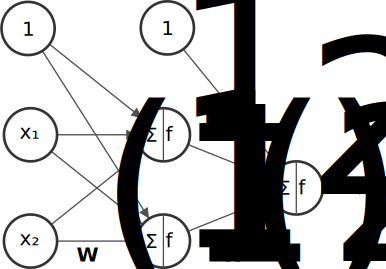

<!-- 
_class: invert lead
_paginate: skip
 -->

# Backpropagation

COMP 4630 | Winter 2025
Charlotte Curtis

---

## Overview
* A brief review of the history of neural networks
* Neurons, perceptrons, and multilayer perceptrons
* Backpropagation
* References and suggested reading:
    - [Scikit-learn book](https://librarysearch.mtroyal.ca/discovery/fulldisplay?context=L&vid=01MTROYAL_INST:02MTROYAL_INST&search_scope=MRULibrary&isFrbr=true&tab=MRULibraryResources&docid=alma9923265933604656): Chapter 10, introduction to artificial neural networks
    - [Deep Learning Book](https://www.deeplearningbook.org/): Chapter 6, deep feedforward networks

---

## The rise and fall of neural networks



In between each era of excitement and advancement there was an "AI winter"

---

## Model of a neuron

<div class="columns">



* McCulloch and Pitts (1943)
* Neuron as a logic gate with time delay
* "Activates" when the sum of inputs exceeds a threshold
* Non-invertible (forward propagation only)

</div>

<footer>Further reading: <a href="https://link.springer.com/article/10.1007/BF02478259">Original Paper</a> (rather dense math) or an <a href="https://marlin.life.utsa.edu/mcculloch-and-pitts.html">Accessible webpage</a></footer>


---

## Threshold Linear Units (TLUs)

<div class="columns">

* Linear I/O instead of binary
* Rosenblatt (1957) combined multiple TLUs in a single layer
* Physical machine: the [Mark I Perceptron](https://news.cornell.edu/stories/2019/09/professors-perceptron-paved-way-ai-60-years-too-soon), designed for image recognition
* Criticized by Minsky and Papert (1969) for its inability to solve the XOR problem - first AI winter

<div>



<span style="font-size: 0.8em; color: gray; text-align: center">

A single threshold logic unit (TLU)

Image source: Scikit-learn book

</span>
</div>
</div>

---

## Training a perceptron

<div class="columns">
<div>

* Hebb's rule: "neurons that fire together, wire together"

    $$w_{ij}^{(updated)} = w_{ij} + \eta (y_j - \hat{y}_j) x_i$$

    where $i$ = input, $j$ = output
* Fed one instance at a time, 
* Guaranteed to converge if inputs are **linearly separable**
* :abacus: Simple example: AND gate


</div>
<div>



<span style="font-size: 0.8em; color: gray; text-align: center">

A perceptron with two inputs and three outputs

Image source: Scikit-learn book

</span>
</div>
</div>

---

## Multilayer perceptrons (MLPs)
* If a perceptron can't even solve XOR, how can it do higher order logic?
* Consider that XOR can be rewritten as:
    
    ```
    A xor B = (A and !B) or (!A and B)
    ```
* A perceptron can solve `and` and `or` and `not`... so what if the input to the `or` perceptron is the output of two `and` perceptrons?
* :abacus: Verify the solution to XOR

---

## Backpropagation
* I just gave you the weights to solve XOR, but how do we actually find them?
* Applying the perceptron learning rule no longer works, need to know how much to adjust each weight relative to the **overall output error**
* Solution presented in 1986 by Rumelhart, Hinton, and Williams
* Key insight: Good old chain rule! Plus some recursive efficiencies

---

## Training MLPs with backpropagation
1. Initialize the weights, usually randomly
2. Perform a **forward pass** to compute the output of each neuron
3. Compute the **loss** of the output layer (e.g. MSE)
4. Calculate the **gradient of the loss** with respect to each weight
5. Update the weights using gradient descent (minibatch, stochastic, etc)
6. Repeat steps 2-5 until stopping criteria met

> Step 4 is the "backpropagation" part

---

## Example: forward pass

<div class="columns">
<div>

* With a linear activation function:
    $$\mathbf{\hat{y}} = \mathbf{X} \mathbf{W}^{(1)} \mathbf{W}^{(2)}$$
* For a single sample $\mathbf{x}$:
    $$\hat{y} = \sum_{j = 1}^{2} w_j^{(2)} \sum_{i = 1}^{2} x_i w_{ij}^{(1)}$$

</div>
<div>


<div style="text-align: center">

$$\mathbf{x} = \begin{bmatrix}2 & 3\end{bmatrix},\hspace{1em} y = 1$$

and

$$\mathbf{W}^{(1)} = \begin{bmatrix}-0.78 & 0.13 \\ 0.85 & 0.23\end{bmatrix}, \mathbf{W}^{(2)} = \begin{bmatrix}1.8 \\ 0.40\end{bmatrix}$$

</div>
</div>
</div>

:abacus: Solve for $\hat{y}$ using the values given

---

## Example: calculate error and gradient
* We never picked a loss function! Let's assume we're using MSE
* For a single sample:
    $$\mathcal{L}(\mathbf{w^{(1)}, w^{(2)}}) = \frac{1}{2}(\hat{y} - y)^2  = \frac{1}{2} \left(\sum_{j = 1}^{2} w_j^{(2)} \sum_{i = 1}^{2} x_i w_{ij}^{(1)} - y\right)^2$$
    with the $1/2$ added for convenience
* The goal is to update each weight by a small amount to minimize the loss
* Fortunately, we know how to find a small change in a function with respect to one of the variables: the partial derivative!

---

## Recursively applying the chain rule

* Weights in the second layer (connecting hidden and output):
    $$\frac{\partial \mathcal{L}}{\partial w_{j}^{(2)}} = \frac{\partial{\mathcal{L}}}{\partial \hat{y}} \frac{\partial \hat{y}}{\partial w_{j}^{(2)}} = (\hat{y} - y) \frac{\partial \hat{y}}{\partial w_{j}^{(2)}} = (\hat{y} - y) \sum_{i} x_i w_{ij}^{(1)}$$

* For the first layer (connecting inputs to hidden):
    $$\frac{\partial{\mathcal{L}}}{\partial w_{ij}^{(1)}} = \left(\frac{\partial{\mathcal{L}}}{\partial \hat{y}} \frac{\partial \hat{y}}{\partial w_j^{(2)}}\right) \frac{\partial{w_j^{(2)}}}{\partial w_{ij}^{(1)}} = \left(\frac{\partial{\mathcal{L}}}{\partial \hat{y}} \frac{\partial \hat{y}}{\partial w_j^{(2)}}\right)x_i$$
---

<!-- Made it this far in first class -->

## Bias terms
* The toy example did not include bias terms, but these are very important (as seen in the perceptron examples)
* With a single layer we can add a column of 1s to $\mathbf{X}$, but with multiple layers we need to add bias at **every layer**
* The forward pass becomes:
    $$\mathbf{\hat{y}} = (\mathbf{X} \mathbf{W}^{(1)} + \mathbf{b}^{(1)}) \mathbf{W}^{(2)} + \mathbf{b}^{(2)}$$
* The calculation of the gradient is fortunately unaffected, but network size increases as weights for the bias terms need to be updated as well

---

## Computational considerations
* Many of the terms computed in the **forward pass** are reused in the **backward pass**
* Similarly, gradients computed in layer $l+1$ are reused in layer $l$
* Typically each intermediate value is stored, but modern networks are **big**

    <div class="centred">

    | Model          | Parameters  |
    | -------------- | ----------- |
    | Our example    | 6           |
    | AlexNet (2012) | 60 million  |
    | GPT-3 (2020)   | 175 billion |

    </div>

---

<!-- 
_class: invert lead
_paginate: skip
 -->

 # Choices in neural network design
 ---

## Activation functions
* The simple example used a **linear activation function** (identity)
* To include other activation functions, the forward pass becomes:
    $$\mathbf{\hat{y}} = \mathbf{f_2}(\mathbf{f_1}(\mathbf{X} \mathbf{W}^{(1)}) \mathbf{W}^{(2)})$$

* The gradient in the output layer becomes:
    $$\frac{\partial \mathcal{L}}{\partial w_{j}^{(2)}} = \frac{\partial{\mathcal{L}}}{\partial f_2} \frac{\partial f_2}{\partial \hat{y}}\frac{\partial{\hat{y}}}{\partial{w_j^{(2)}}}$$
* Problem! That step function in the original perceptron is not differentiable

---

## Activation functions
* A common early choice was the sigmoid function:
    $$\sigma(z) = \frac{1}{1 + e^{-z}}, \hspace{0.5cm} \frac{d\sigma}{dz} = \sigma(z)(1 - \sigma(z))$$
* A more computationally efficient choice common today is the "ReLU" (Rectified Linear Unit) function:
    $$\text{ReLU}(z) = \max(0, z), \hspace{0.5cm} \frac{d\text{ReLU}}{dz} = \begin{cases} 0 & z < 0 \\ 1 & z > 0 \end{cases}$$
* What about $z = 0$? Most implementations just set it to 0

<!-- Draw the functions and derivatives on the board -->

---

## Activation functions in hidden layers

> The design of hidden units is an extremely active area of research and does not yet have many definitive guiding theoretical principles.
> -- Deep Learning Book, Section 6.3

* Activation functions in hidden layers serve to **introduce nonlinearity**
* Common for multiple hidden layers to use the same activation function
* Sigmoid, ReLU, and tanh (hyperbolic tangent) are common choices
* Also "leaky" ReLU, Parameterized ReLU, absolute value, etc
* Can be considered a **hyperparameter** of the network

---

## Loss functions
* The choice of loss function is very important!
* Depends on the task at hand, e.g.:
  - Regression: MSE, MAE, etc
  - Classification: Usually some kind of cross-entropy (log likelihood)
* May or may not include regularization terms
* Must be differentiable, just like the activation functions

---

## Activation functions in the output layer
* Activation functions in the **output** layer should be chosen based on the loss function (and thus the task)
    - Regression: linear
    - Binary classification: sigmoid
    - Multiclass classification: softmax (generalization of sigmoid)
* Again, must be differentiable

---

## A complete fully connected network



---

<!-- 
_class: invert lead
_paginate: skip
 -->

 # Next up: Classification loss functions and metrics